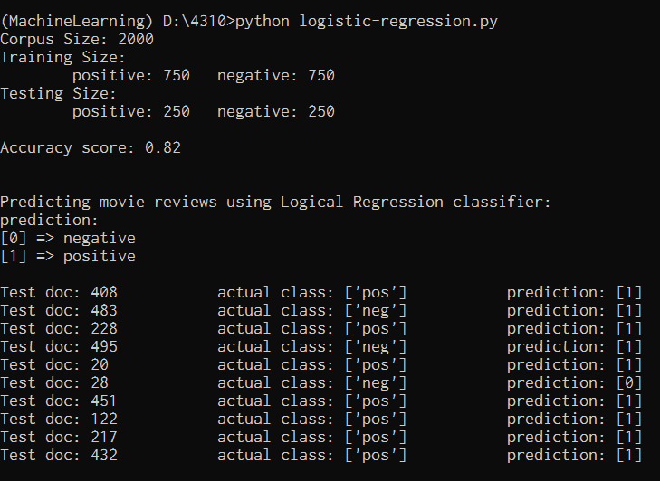

# Natural Language Processing Assignments

## 1. Porter Stemmer
Checks if the words filled out in the script.in file matches the stem of words in the answer.in file using the Porter Stemmer module in Python.

to run: ``python porter-stemmer.py``

## 2. Shannon Sentence Generator
Generates random sentence using bigram and trigram, following Shannon Visualization Method.

to run: ``python shannon.py``

## 3. Naive Bayes Classifier
Classifies movie reviews according to their sentiment polarity using Naive Bayes classifier.

to run: ``python naive-bayes.py``

## 4. Logistic Regression Classifier
Classifies movie reviews according to their sentiment polarity using Logistic Regression.

to run: ``python logistic-regression.py``

## 5. Cosine Similarity Comparer
Compares two documents and determines how similar they are. The closer the cosine value to 1 is, the more the documents are similar.

to run: ``python cos-similarity.py``

## 6. Multi-layer Neural Network Classifier
Classifies movie reviews according to their sentiment polarity using Multi-layer Neural Network, with 10 hidden layers and 5 units each layer.

to run: ``python neural-network.py``

